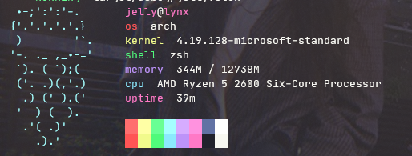

# jellyfetch
my personal simple fetch tool in rust. inspired by ~~and maybe code taken from~~ [bunnyfetch](https://github.com/Luvella/Bunnyfetch), [rsflex](https://github.com/curlpipe/rsflex), [yan](https://github.com/yannjor/yan), and [ferris-fetch](https://github.com/irevenko/ferris-fetch).

in the future, i might want to actually fetch colors from terminal myself and get rid of deps

